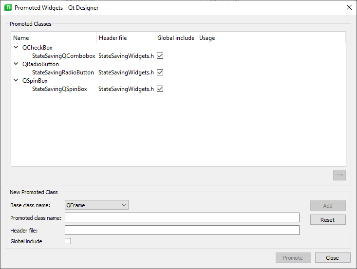

# PyQt5 State Saving Widgets

Ever wanted to make an app that "remembers" the users choices?  
This is an example/usable specific QWidgets that does exactly that.  

### How to:

NOTE: This is designed mostly for promoting widgets in QDesigner

1. Add Widgets as promoted class in QDesigner:

2. Promote the default widgets to the new ones.

3. Done.